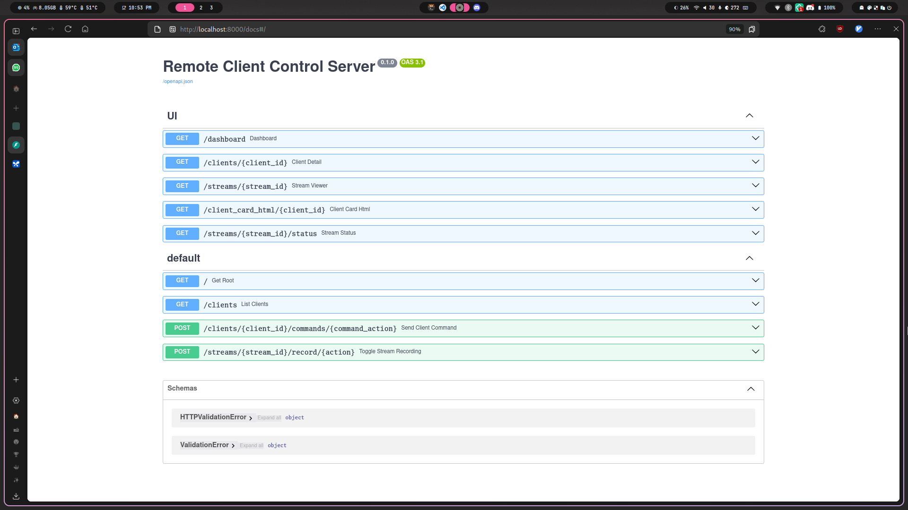

# Orka: Orchestrator Kernel for Agents

Orka is a Python framework for building and controlling modular AI agents across multiple platforms including Linux, Android (via Termux), Raspberry Pi, and microcontrollers.

## What is Orka?

Orka (Orchestrator Kernel for Agents) provides a flexible infrastructure for:

- Creating AI agents with configurable personas and behaviors
- Running on various hardware platforms from smartphones to embedded systems
- Supporting multiple LLM providers (currently focusing on Gemini)
- Enabling hardware interaction (audio, camera, sensors) across platforms
- Providing a unified interface regardless of underlying hardware


## TODO

- [ ] Finish V feature. ( Voice to Voice/Text as of now just TTS/STT is working )
- [ ] Implement P,T together ( photo and TTS/STT both simul)
- [x] Agentic Framework rather than it being Roastty.
- [ ] Add detailed faliures for what can happen in android/rpi.
- [x] add vnc and streaming for phones soon
- [ ] Stop streaming needs to be added.
- [ ] Do SLAM properly ( it's generated as of now, doesn't work)
- [ ] ?live endpoint on stream view
## Getting Started

1. **Clone the Repository:**

   ```bash
   git clone https://github.com/mostlyKIGuess/Orka.git
   cd Orka
   ```

2. **API Key Setup:**

   - Get a Gemini API key from [Google AI Studio](https://aistudio.google.com/)
   - Create a `.env` file in the project root:
     ```dotenv
     GEMINI_API_KEY=YOUR_API_KEY_HERE
     ```

3. **Installation:**

   - **Core Dependencies (All Platforms):**
     ```bash
     pip install -r requirements.txt
     ```

   - **Platform-Specific Setup:**
     - [Android/Termux Setup](#android-with-termux)
     - [Raspberry Pi Setup](#raspberry-pi-setup)
     - [Linux Desktop Setup](#linux-desktop-setup)

## Cross-Platform Support

### Android with Termux

1. Install [Termux](https://f-droid.org/packages/com.termux/) and [Termux:API](https://f-droid.org/packages/com.termux.api/)
2. Install required packages:
   ```bash
   pkg update && pkg upgrade
   pkg install python git termux-api
   pip install -r requirements.txt
   ```
3. Grant necessary permissions (camera, microphone, storage)

PS: You might run into things, I will add those here soon!, but just a google search would be fine

### Raspberry Pi Setup

1. Install system dependencies:
   ```bash
   sudo apt-get update
   sudo apt-get install espeak python3-pip git portaudio19-dev
   ```
2. For camera support:
   - RPi Camera Module: `pip install picamera2`
   - USB Webcam: `pip install opencv-python`
3. For audio support:
   ```bash
   pip install pyttsx3 SpeechRecognition PyAudio
   ```

### Linux Desktop Setup

1. Install system dependencies:
   ```bash
   sudo apt-get update
   sudo apt-get install espeak python3-pip git portaudio19-dev
   ```
2. Install audio and camera libraries:
   ```bash
   pip install pyttsx3 SpeechRecognition PyAudio opencv-python
   ```

## Usage

```bash
python main.py
```

Follow the interactive prompts to interact with your agent.

## Configuration

You can customize your agent by modifying `config.py`:

- Change the agent's name and personality
- Configure different LLM models
- Adjust platform-specific settings

## Development

- HEAVY WORK IN DEVELOPMENT RIGHT NOW!!! .Anything can break anytime.

Orka is designed to be extended with additional:
- LLM providers beyond Gemini
- Hardware interactions beyond audio and camera
- Platform support beyond current targets

## Modes of Operation

### 1. Client-Server Interface

Orka can be run in a distributed mode where multiple clients connect to a central server for orchestration and remote control.

#### Running the Server

1. Start the FastAPI server:
   ```bash
    uvicorn server.main_server:app --reload --host 0.0.0.0 --port 8000
   ```
2. Access the web dashboard at `http://localhost:8000/dashboard` to monitor and control connected clients.

#### Running a Client

1. On the device you want to control, run:
   ```bash
   python client/main.py --server ws://<server-ip>:8000/<client_name>
   ```
   Replace `<server-ip>` with your server's IP address and `<client_name>` with a unique name for the client.
2. The client will register with the server and appear in the dashboard.
3. You can now send commands, trigger media capture, and manage streams from the server UI.

#### Notes
- Multiple clients can connect to the same server.
- Clients can run on different platforms (Linux, Android, Raspberry Pi, etc).
- Ensure network connectivity between client and server.

### 2. Standalone Mode

Orka can also run in standalone mode, where the agent operates independently on a single device without connecting to a central server.

#### Running in Standalone Mode

1. On your device, run:
   ```bash
   python client/main.py --standalone
   ```
2. The agent will operate locally, using the configured persona and hardware features.
3. You can interact with the agent via the terminal or local UI (implementation soon).
4. This is the same as main.py that we have on parent directory.

#### Use Cases for Standalone Mode
- Personal assistant on a single device
- Offline operation without network dependency
- Rapid prototyping and testing

### Switching Between Modes
- Use the `--server` argument to run as a client connecting to a server.
- Use the `--standalone` argument to run independently.
- Use the `--both` argument to run both. Example:
```sh
python client/main_client.py --both --server ws://localhost:8000
```
- Configuration for each mode can be set in `config.py` or via command-line arguments.

## Features 

### 1. Remote Client Management
- Register and monitor clients: Clients connect via WebSocket, register with name, platform, and capabilities.
- Live dashboard: View all connected clients, their status, last seen, and capabilities in real time.
- Client detail panel: Inspect individual clients, their streams, and control them via the web UI.

### 2. Remote Commands & Automation
- Text-to-Speech: Send text to a client for speech output (if supported).
- Image Capture: Remotely trigger a client to capture and upload an image.
- Video Streaming: Start/stop video streams from clients, view stream status, and record streams on the server.

### 3. Media Handling
- Image saving: Images captured from clients are saved on the server.
- Video recording: Video streams can be recorded and saved as MP4 files.
- Stream status: Monitor and control recording state for each stream.

### 4. Web UI
- Dashboard: Real-time, auto-refreshing dashboard for all clients.
- Client cards: Quick view of client status, capabilities, and active streams.
- Stream viewer: View stream info, control recording, and see stream health.
- AJAX updates: UI updates client cards and stream status without full page reloads.

## Use Cases

- Personal assistant on a smartphone or Raspberry Pi
- Remote monitoring and control of devices (e.g., home automation, security cameras)
- Interactive AI assistants on smartphones or embedded systems
- Real-time data processing and analysis from multiple sources
- Emphasising on the analysis point, you can have multiple bots run around to map some stuff.
- You can send the bot along with your RC, have it stream, record the lecture, take notes, talk to other people etc. ( You can also just send TTS there )

## API Reference

### WebSocket Endpoint

- `/{client_name}`  
  Main WebSocket endpoint for clients to connect and register.

#### WebSocket Message Types

- register: Client registration (first message, with payload: client_name, platform, capabilities)
- command: Server-to-client command (payload: action, params)
- command_response: Client-to-server command response (payload: command_id, status, data, error_message)
- ping / pong: Heartbeat messages
- stream_status: Client stream status updates
- media_ack: Server acknowledges receipt of binary media

#### Binary Media Format

- Prefix (4 bytes): "IMG:" or "VID:"
- Sequence (4 bytes, big-endian)
- Stream ID (null-terminated UTF-8 string)
- Media payload (image or video frame bytes)

### HTTP API Endpoints

#### Docs

Go to `http://localhost:8000/docs` to see the auto-generated API documentation.


#### Client Management

- `GET /clients`  
  List all connected clients and their status.
- `GET /clients/{client_id}`  
  Get details and status for a specific client (dashboard UI).

#### Command Endpoints

- `POST /clients/{client_id}/commands/{command_action}`  
  Send a command to a client (e.g., speak_text, capture_image, start_video_stream). Body: JSON params for the command.

#### Stream Endpoints

- `GET /streams/{stream_id}`  
  View stream info and controls (dashboard UI).
- `GET /streams/{stream_id}/status`  
  Get status of a specific stream (JSON).
- `POST /streams/{stream_id}/record/{action}`  
  Start or stop recording for a stream. `{action}` is `on` or `off`.

#### Dashboard & Status

- `GET /dashboard`  
  Web dashboard for real-time monitoring and control.
- `GET /client_card_html/{client_id}`  
  Get HTML for a single client card (AJAX, dashboard UI).
- `GET /status`  
  Get server status and health info (if implemented).

## Running Orka: Modes and Capabilities

Orka can operate in two primary modes: client-server (distributed) and standalone (local). Each mode offers a range of features for different use cases.

### Running in Client-Server Mode

- **Start the server:**
  ```bash
  python server/main.py
  ```
  Access the dashboard at `http://localhost:8000/dashboard`.

- **Start a client:**
  ```bash
  python client/main.py --server ws://<server-ip>:8000/<client_name>
  ```
  Replace `<server-ip>` with your server's address and `<client_name>` with a unique identifier.

- **What you can do in client-server mode:**
  - Register and monitor multiple clients from the dashboard
  - View client status, last seen, and capabilities in real time
  - Send remote commands (text-to-speech, image capture, start/stop video stream)
  - View and control video streams, start/stop recording
  - Download images and video recordings from clients
  - Use the web UI for centralized management and monitoring


## A bit of History
- If you will browse the commits, this started as Roastyy, a fun lil bot that I wanna make that can go someowhere look at something and talk and roast it, it was a good idea, but now I realized I can turn this into a good library that I can develop later with more features, and have agents rather than a hardcoded persona that is Roastyy, rip Roastyy, bro got deleted before it even made it through github, but yes, the first commits will be roastyy, so if you wanna explore go ahead!.
